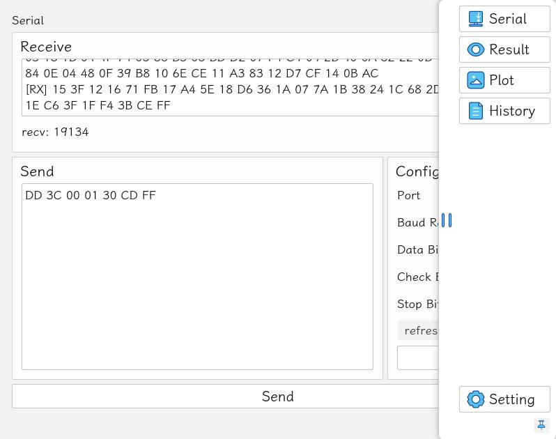
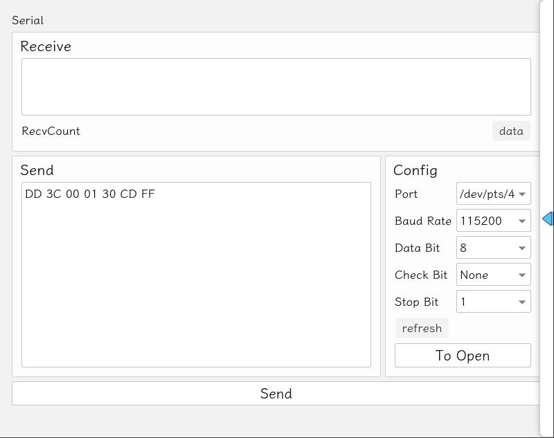
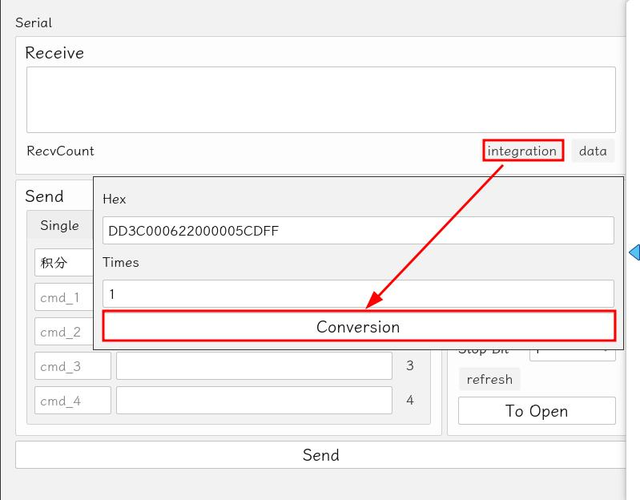
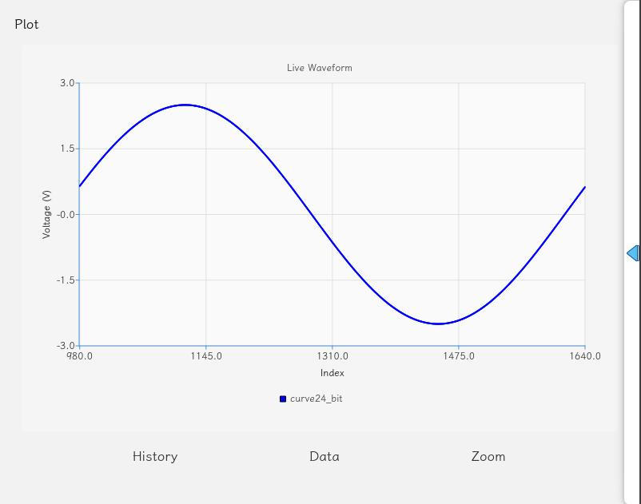
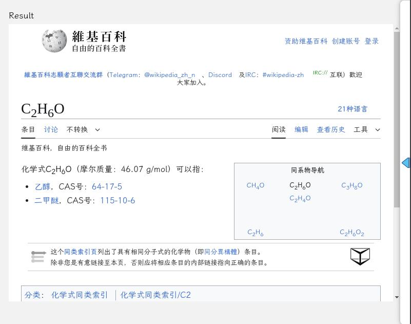
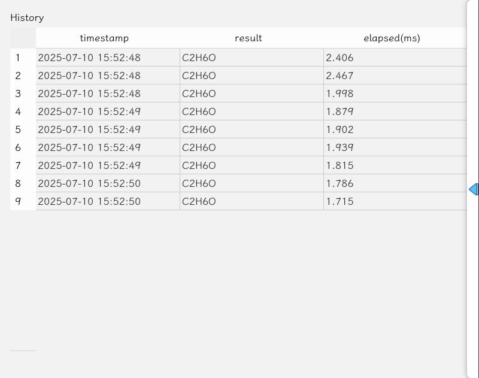
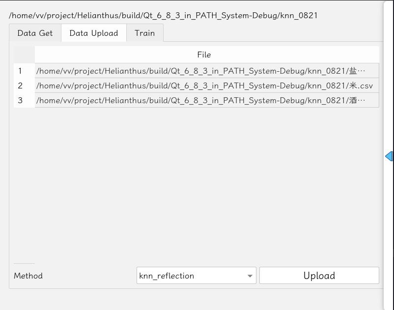

# Helianthus

## 依赖

- Widgets
- Charts
- SerialPort
- WebEngineWidgets
- Network



## Serial





积分指令：`DD3C000622` + time + `CEFF`

time, 5ms 一次

数据请求指令：`DD3C000330CDFF`

## Plot



## Result



## History



## Self-Train



```bash
pm2 start my_train.py --name my_train --interpreter python --cwd ./my_train
```

## server

- `composition_separation.py`：组合物质分离
- `knn_predict.py`：单一物质识别
- `my_train.py`：Self-Train 使用服务
- `train_knn.py`：训练 knn 模型，对应`knn_predict.py`
- `train_regression.py`：训练回归模型，对应`composition_separation.py`
